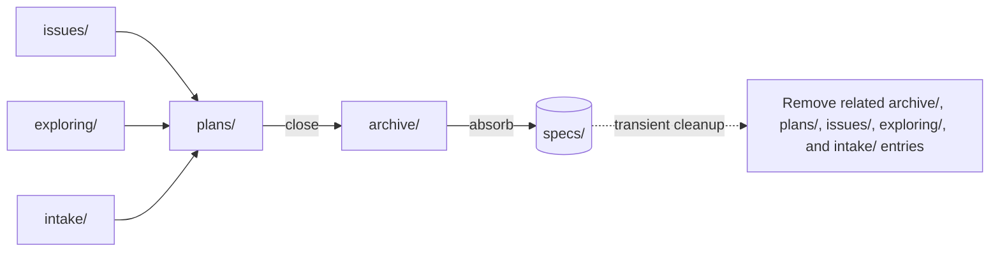

<!-- cumaru:components -->
| Link | Description |
|------|-------------|
_(replace with your actual stack)_
<!-- /cumaru:components -->

<!-- cumaru:root -->
_(empty — replace with adopter-specific context, or delete this placeholder)_
<!-- /cumaru:root -->

# SDLC domain (software-development workflow)

This file declares the SDLC domain's specifics — pillars, roles, entry, and domain context — pulled into context as the root `index.md`'s `depends-on`. The kernel rules (the node model, the loading rule, conduct, language) live in `index.md` and are identical across all domains.

## Pillars (root's children)

```
.cumaru/
├── index.md      ← kernel (identical across domains)
├── config.yaml   ← canonical contract
├── domain.md     ← this file (this domain's specifics)
├── intake/       ← tracker-agnostic mirror of work items
├── plans/        ← active execution plans (each: a plan + its tasks/handoffs/delta-draft)
├── archive/      ← completed plans + their finalized deltas (never loaded by default)
├── specs/        ← living spec; areas nest subareas; the ground truth of the system
├── exploring/    ← pre-plan ideas in incubation (never loaded by default)
├── issues/       ← locally authored issues, ready to become plans (never loaded by default)
├── roles/        ← agent roles (lead, dev, ghost)
└── templates/    ← entity templates
```

- **`intake/` — what is asked.** A flat, **tracker-agnostic** mirror of work items: each lives at `intake/<KEY>.md`, carries `key` + `type` (the tracker issuetype), and links to others via `relates` (many-to-many, non-blocking). No enforced hierarchy. The tracker is named once by `tracker` on `intake/index.md`.
- **`plans/` — how we will do it.** One `plans/<PLAN-ID>/` per active plan. Its `index.md` declares `scope` (which `specs/` paths it touches) and links to intake via `key` (optional for slug-based `maintenance-<slug>` plans). Tasks, handoffs, and the delta-draft live inside.
- **`archive/` — close-out staging.** Completed plans move here after implementation, then leave after their delta is absorbed into `specs/`; never loaded by default.
- **`specs/` — what is true now.** The living spec. Areas nest subareas to any depth; `depends-on` is the strongest load signal, `relates` is "consider". On plan close the delta is absorbed into the area whose scope actually owns it; `git log` is the only cross-reference back to the plan.
- **`exploring/` — pre-plan ideas.** Incubators with no commitment; transient. Never loaded by default.
- **`issues/` — locally authored work items.** Contextual bugs, features, improvements, and chores created in chat rather than mirrored from a tracker. They carry a concise issue contract and are transient. Never loaded by default.

## Flow



Tracker items mirrored in `intake/`, locally authored issues in `issues/`, and ideas from `exploring/` feed into
`plans/`. On close the plan moves to `archive/` and its delta-draft is absorbed
into `specs/`. Once absorbed, all transient content for that cycle is removed —
the archive row/directory, the plan dir, the related intake items, and the
exploring entry. Only `specs/` — the living spec — remains as durable record.

## Roles

- **Lead** — primary author of `.cumaru/`. Plans work, maintains specs, runs the archive flow, dispatches Dev sub-agents, owns `exploring/` and `issues/`.
- **Dev** — implements tasks inside the active plan. Bounded writes: own `t<N>.md`, `handoff-t<N>.md`, and `delta-draft.md` at close. Never writes elsewhere in `.cumaru/`.
- **Ghost** — IDE-pair agent for ad-hoc help. Read-only by default; never writes inside `.cumaru/`.

`intake/` is a tracker mirror — syncing it is mechanical, not a role responsibility. Roles only **read** intake.

### Shallow indexes per role (this domain's entry into the loading rule)

| Role  | Shallow indexes loaded                                                     | Rationale |
|-------|----------------------------------------------------------------------------|-----------|
| Lead  | `plans/index.md`, `specs/index.md`, `intake/index.md`, `archive/index.md`, `issues/index.md` | Orchestrates — needs the full map. |
| Dev   | none                                                                       | Operates inside a dispatched `plans/<PLAN-ID>/`. |
| Ghost | none                                                                       | Ad-hoc, read-only; pulls a shallow only when the question requires it. |

### Plan-scoped entry

When a plan is active it declares `scope:` (paths under `specs/`) and `aux:`; the linked intake item (`key`) and the scoped spec areas are the **declared entry** — the loading-rule traversal starts from those nodes, nothing else.

## Execution disciplines

Framework-shipped conduct for *how* work is done — distinct from the pillars, which hold *what*
the project is. Every modular file in `disciplines/` is loaded at context start; `applies-when:`
controls when its rules apply, never whether its body is loaded. Each file carries a `strictness:`
(0–10, where 10 = inflexible when applicable, 0 = fully optional). Disciplines absorbed from external skills
are MIT-attributed in each file's `source:`; the engineering-principle disciplines (DRY / KISS /
YAGNI / SOLID) are authored in-house and carry no `source:`.

| Discipline | Applies when | File |
|---|---|---|
| cumaru-first | repository work can benefit from a relevant Cumaru surface | `disciplines/cumaru-first.md` |
| engineering | performing software engineering work or reporting technical results | `disciplines/engineering.md` |
| verification | about to claim work complete; before commit / PR / handoff | `disciplines/verification.md` |
| systematic-debugging | a bug / test failure / unexpected behavior — before fixing | `disciplines/systematic-debugging.md` |
| test-driven-development | implementing a feature or bugfix, before writing code | `disciplines/test-driven-development.md` |
| receiving-code-review | acting on code-review feedback | `disciplines/receiving-code-review.md` |
| acceptance-testing | a plan is implemented and about to close — verify acceptance criteria with evidence | `disciplines/acceptance-testing.md` |
| dry | same knowledge / rule risks living in more than one place | `disciplines/dry.md` |
| kiss | choosing how to implement, when a simpler option exists | `disciplines/kiss.md` |
| yagni | tempted to build beyond a present, stated requirement | `disciplines/yagni.md` |
| solid | designing / refactoring structure — responsibilities, extension, coupling | `disciplines/solid.md` |
| code-comments | writing any code comment, or deciding whether an explanation belongs in code or in domain prose | `disciplines/code-comments.md` |
| blast-radius | fixing scope:/files: for a change whose reach the spec graph doesn't already describe | `disciplines/blast-radius.md` |

New disciplines are produced with the repo's `skill-to-discipline` skill (distill an external
`SKILL.md` → gate + cycle + red flags).

## Domain context (web/software)

> The framework was first applied to a web/software workflow. This is reference; the kernel itself is not software-specific.

- **vs. OpenSpec** — OpenSpec keeps specs monolithic per capability; `.cumaru/` splits by concern, allows per-component divergence and slug-based plans, and separates pre-plan ideas in `exploring/`.
- **vs. GitHub Spec Kit** — Spec Kit recreates intake locally and grows verbose; `.cumaru/` mirrors the tracker instead and curates the archive so it never loads by default.
- **vs. Kiro / requirements notation** — `.cumaru/` accepts EARS and RFC 2119 for acceptance criteria as a **warning**, not a blocker; narrative sections stay free prose.
- **vs. memory bank (Cline / Roo)** — memory bank focuses on session state; `.cumaru/` focuses on durable system state (living spec) + operational plan + curated archive + pre-plan ideation.
